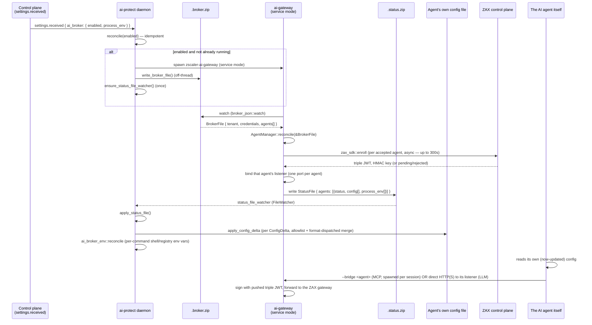

# ai-protect ↔ ai-gateway — information flow

Supersedes the flow-diagram content of the older design record linked from
`ai-gateway/docs/README.md` (`claude.ai/code/artifact/9d348c21-...`) — that
page's own header already flags itself as predating the module split
(three now-retired CLI modes, an old bootstrap flow). This doc reflects the
current tree; re-check it against the code before relying on a detail, the
same caveat the old one carried.

Companion docs: [`broker-status-file-schema.md`](broker-status-file-schema.md)
(the wire schema referenced throughout this doc) and
[`ai-gateway/docs/OperationalModes.md`](../ai-gateway/docs/OperationalModes.md)
(the operating guide — how to run and verify each mode).

## The two processes

| | ai-protect | ai-gateway (`zscaler-ai-gateway`) |
|---|---|---|
| Privilege | root / LocalSystem, resident daemon | user-space, per-session or one long-lived "service mode" instance |
| Build graph | never links ai-gateway's crates | separate binary, shipped alongside the daemon |
| Owns | discovery, policy, the real agent config files | enrolment, MCP/LLM listeners, the credential store |
| Talks to | ai-gateway (files only), ai-platform (its own device-plane channel) | the ZAX control plane (vector), the ZAX gateway (Optimus) |

**No socket, no named pipe, between the two.** Each writes exactly one file
for the other to watch; either can restart independently, and a stale
watcher (wrong binary version on one side) fails silently rather than
erroring — see the Gotchas section.

## Lifecycle, end to end

Four things independently wake ai-gateway's service-mode loop (not just
`.broker.zip` changing) — this is easy to under-model if you only look at
the happy path:

| Wake source | Why it exists |
|---|---|
| `.broker.zip` changed | the agent list or the pushed credential moved |
| an enrolment task completed | `zax_sdk::enroll` blocks up to 300s on approval — can't be awaited inline without stalling every other write |
| the credential store changed | something *other than* this process wrote it (tamper) — restore |
| a 30s refresh tick | the credential's freshness and an agent's triple-JWT validity both age out with nothing else writing a file |

On the ai-protect side, the corresponding independent triggers are:
`settings.received` (the `ai_broker` toggle), an agent-discovery rescan
(`on_agent_rescan` — rewrites `.broker.zip`'s agent list, no diffing), and
the `.status.zip` file watcher itself.

## Two legs, two mechanisms

**MCP leg** — `--bridge <agent>` is a separate CLI mode, spawned by the
*agent itself* per session (not by the daemon, not part of service mode). It
reads the credential store ai-gateway's service mode already populated,
relays JSON-RPC over stdio, and signs outbound gateway calls with the pushed
triple JWT. With no record for that agent yet, the bridge still starts and
advertises no tools — every request then fails `NoCredentials` rather than
an unsigned request reaching the gateway.

**LLM leg** — one in-process listener per agent (`http` or `https`, picked
by that adapter's config), all behind one request pipeline
(`ai-gateway-listener`): resolve destination → build the outbound request in
one place (strip hop-by-hop + any caller-supplied `signature*`/`x-zax-*`
headers, set `Host`, sign, insert the four ZAX headers) → dial the
configured gateway over an owned socket (HTTP/1.1 only — the `Host` header
carries the real destination, which HTTP/2's `:authority` would contradict).
`https` serves **both** a base-URL client and a CONNECT-then-TLS forward-proxy
client **on the same port**, disambiguated by peeking the first byte
(`0x16` = TLS ClientHello, ASCII `C` = a CONNECT request line).

## Config delivery — the one-writer rule

`ConfigDelta`/`ManagedEnvVar` are *descriptions* of intent; ai-gateway never
writes an agent's real config file or touches the OS environment itself.
ai-protect is the sole writer, and it enforces two independent gates before
any byte lands (detailed in the schema doc): the file must be on
`ALLOWED_CONFIG_PATHS`, and the merge is dispatched by extension (TOML/YAML/
JSON), each format refusing rather than replacing on a parse failure.

**Full snapshot in, idempotent merge out.** `.status.zip` re-sends every
serviceable agent's complete wiring on every write (not a diff), so
ai-protect's merge has to tolerate being handed the same delta repeatedly —
a JSON-object merge and an atomic file rewrite are naturally idempotent, so
this costs nothing, but it's worth knowing when reading logs: "applied
config delta ... for agent X" is expected on nearly every `.status.zip`
write for a healthy agent, not just the first time.

**No config until the agent can be served.** Empty `config: []` is "nothing
to change," not "unwire" — there is no retract verb in this protocol. An
agent whose triple JWT lapses keeps whatever config it was last given; its
requests fail `NoCredentials` until the credential refreshes. Undoing a
wiring is `--recover`'s job (CLI-only today, not wired into the disable
path — see Gaps below).

## Known gaps worth flagging on review

Carried over verbatim from the current code's own doc comments — not
guesses, and not fixed by this doc:

1. **Privilege drop is incomplete on Linux.** Windows and macOS both drop to
   the console user's session before spawning ai-gateway; Linux has no
   portable console-session-uid primitive without parsing `utmp` or shelling
   to `loginctl` (unacceptable in a root daemon), so a Linux root daemon
   still spawns ai-gateway in its own root context.
2. **The user-JWT identity handoff is a stub.** `identity::zax_user_credential::fetch`
   on the ai-protect side returns nothing real yet; `.broker.zip`'s
   `credentials` block is blank in practice, so ai-gateway always falls
   back to its own cached refresh token or interactive OIDC.
3. **Single-user scoping.** `.broker.zip`/`.status.zip` watch/write is
   scoped to one supervised broker's home. Multi-user hosts are not yet
   handled by this file-protocol migration.
4. **Disabling the broker doesn't unwire config.** `reconcile(false)` stops
   the process and tears down process-env vars
   (`ai_broker_env::reconcile(&empty)`), but the `ConfigDelta`/`--recover`
   path is CLI-only — `unwire_other_agents()`/`recover()` are never called
   from the disable path. A device that turns `ai_broker.enabled` off keeps
   whatever config deltas were last applied until someone runs
   `--recover` by hand.
5. **No snapshot-before-merge on the ai-protect side.** The old bootstrap
   captured an agent's prior `ANTHROPIC_BASE_URL` before overwriting it, so
   `--recover` could restore it. `apply_config_delta` merges atomically but
   takes no backup and records no prior value — recorded as a tracked
   follow-up in `ai-gateway/docs/OperationalModes.md`, not fixed here.
6. **The ZAX root CA is embedded in the binary and trusted unconditionally**,
   release builds included — whoever holds its private key can present a
   certificate the gateway leg accepts, on every device running this binary.
   Narrowing this needs gating `trust::ZAX_ROOT_PEM` on a tenant/environment
   signal.
7. **Loopback is the only gate on a listener port.** Any local account on
   the box can reach it and have traffic signed with this device's ZAX
   identity. The per-install path-token that used to narrow this was
   deliberately dropped (see `ai-gateway/listener/DESIGN.md`).

## Where the two `advisory`/older concepts went

Two things a reviewer who saw the earlier design record may look for and not
find, on purpose:

- **`enforce_mcp` advisories** (`<agent config dir>/advisory.json`, mirroring
  ai-protect's resolved MCP allow/block decision into the agent's directory
  for visibility) — removed. The current `StatusFile`/`BrokerFile` schema has
  no `advisories` field, so nothing on either side carries or writes it
  today. Restorable, but both halves (the writer and the schema field) need
  to come back together, not just one.
- **Per-install path token in the listener URL** (`https://127.0.0.1:<port>/<token>/v1`) —
  removed; see gap 7 above.
