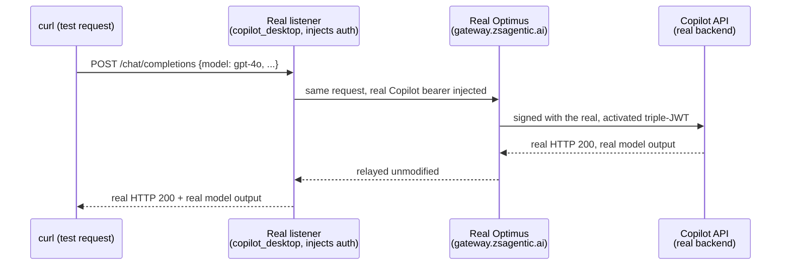

# GitHub Copilot desktop app — real end-to-end verification, through real Optimus

2026-09-29. Closes the loop the `ai-protect` plan (`copilot_app_provision.rs` /
`listener::kinds::copilot_desktop`) left open: does the real, shipped
header-injection listener actually work, all the way through **real**
Optimus, to the **real** `api.githubcopilot.com`, with a **real** activated
agent identity? Answer: **yes, confirmed live** — a real `200` with real
model output, through the real gateway, signed with a real triple-JWT.

Companion to `ai-testing/docs/copilot-app-mitm-proxy-setup.md` (the traffic
-decryption side-quest that happened partway through this) and
`ai-broker-work/ai-broker-llm-brokering.md`'s "Live verification (2026-08-11)"
section (the historical attempt this one re-runs and gets further than).

## The final proof, as a sequence

The closing test (step 10 below) — everything before it built up to being able
to run this one request for real:



## Components used

| Component | Role | Location |
|---|---|---|
| **GitHub Copilot desktop app** | The real target — real account, real `data.db` | `/Applications/GitHub Copilot.app` |
| **`listener::kinds::copilot_desktop`** | The real, shipped listener kind under test — injects the real Copilot bearer + identity headers | `ai-protect/ai-gateway/listener/src/kinds/copilot_desktop.rs` |
| **`simulate-ai-gateway`** | Dev harness: real listener + a *fake*-Optimus relay (bypasses Optimus, used before the real-Optimus leg was built) | `ai-protect/ai-gateway/simulate-ai-gateway/` |
| **`simulate-ai-protect`** | Dev harness: runs the real `copilot_app_provision` SQLite write against a copy of the real `data.db` | `ai-protect/simulate-ai-protect/` |
| **`copilot-desktop-simple`** | Dev harness: real listener bound against **real Optimus**, signed with a **borrowed, real** agent's credentials | `ai-protect/ai-gateway/copilot-desktop-simple/` |
| **`activate-agent`** (new, built during this session) | Runs the real `zax_sdk::enroll` pipeline (Vector register/poll → Bumblebee activate → token-exchange) for one agent id, outside the full continuous service | `ai-protect/ai-gateway/activate-agent/` |
| **`approve_agent.py`** | Existing admin tool: OIDC admin login → `POST .../agent-operations/{id}/transition {"status":"approved"}` | `zax-sdk-python/script/approve_agent.py` (+ `script/admin.yaml`, tenant `aibroker-engineer.zslogin.net`, `cloud: prod`) |
| **`get_copilot_token.sh`** | Real GitHub OAuth device flow → real Copilot bearer | `ai-protect/ai-gateway/scripts/get_copilot_token.sh` (sibling `main-08272026-vscode-copilot` branch) |
| **mitmproxy** (venv, temporary) | Decrypted the app's own first-party ("Auto") traffic to find its real endpoint + quota data | see `copilot-app-mitm-proxy-setup.md` |
| **`~/.zsai-gateway/.credentials.zip`** | Real, persisted triple-JWT/HMAC for the `codex` agent id, written by `activate-agent` | real, still on disk |
| **`~/.zsai-gateway/copilot-upstream-token.txt`** | Real Copilot bearer, from `get_copilot_token.sh` | real, still on disk |

## What was actually run, in order

1. **Real Copilot bearer.** `get_copilot_token.sh --quiet` → real GitHub OAuth
   device flow → token written to `~/.zsai-gateway/copilot-upstream-token.txt`.
2. **First app-driven pass, through a fake-Optimus relay
   (`simulate-ai-gateway`).** Hand-edited the real `data.db`'s existing
   `custom:test-probe-3-2026-09-28` provider's `baseUrl` to point at it (the
   proven manual technique). Real app → real listener → fake relay → real
   `api.githubcopilot.com`. Got real, informative `400`s — not 401s — proving
   auth injection was accepted:
   - `test-model-3`/`gpt-5.5`/`gpt-5-mini` → `model_not_supported`.
   - Direct `curl` sweep of model names found `gpt-4o`/`gpt-4.1`/`gpt-4o-mini`
     return real `200`s; every GPT-5.x/Claude/Gemini/Kimi/o-series name
     doesn't. (Root cause found later, step 4.)
   - `reasoning_effort` mismatch: the app's "Interactive" mode always
     attaches one (Low/Medium/High/Extra High, no "None"), and `gpt-4o`
     rejects any value. Fixed by having `simulate-ai-gateway`'s relay (dev
     -only scaffolding, not the real listener) strip that field before
     forwarding.
   - With `gpt-4o` + the strip fix: **real `200`, real joke response**,
     through the fake relay. First full app-driven success.
3. **mitmproxy decryption of the app's own "Auto" traffic** (full setup in
   `copilot-app-mitm-proxy-setup.md`). Found: the account's real endpoint is
   `api.individual.githubcopilot.com` (a per-plan-tier host — tested, turned
   out not to be the actual explanation); and the real explanation:
   `quota_snapshots.premium_interactions = {remaining: 0, entitlement: 0}`,
   `access_type_sku: "free_limited_copilot"` — **this account's plan has zero
   premium-model quota**, which is why every non-`gpt-4o`-family model
   returned `model_not_supported`, independent of anything in this pipeline.
4. **Real-Optimus research.** Read the sibling `main-08272026-devin-testing`/
   `main-08272026-vscode-copilot` branch history and
   `ai-testing/docs/ai-broker-work/ai-broker-auth.md` +
   `ai-broker-llm-brokering.md`. Found the real activation chain (user OIDC →
   Vector `agents:register`/`:status` → Bumblebee `activations` →
   `token-exchange` → triple JWT), that `ai-gateway/sdk` (`zax_sdk`) is a
   direct Rust port of the Python `zax_client` SDK `approve_agent.py` uses,
   and the historical 2026-08-11 finding: a fully activated agent got
   `intersected_caps=[]` and Optimus **403**'d all brokering.
5. **Built `activate-agent`** (new crate) to run `zax_sdk::enroll` directly,
   real OIDC login, against `cloud: prod` (matching `admin.yaml`). Iteratively
   fixed two real backend validation errors neither obvious nor documented
   beforehand:
   - `package.format ""` is rejected — needs a real value (`"binary"`, the
     one this SDK historically shipped for every agent, per its own test).
   - `agent.agent_type` is validated against a fixed **allowlist of
     frameworks** server-side — `"copilot-desktop"` isn't in it yet (a
     backend-side change, not fixable from any client). Switched to
     `--agent codex` (an already-recognized framework) to test the
     mechanics honestly, not pretending to register the real thing.
6. **Real registration succeeded**: `agent_id=2383cc4a-3977-4e7b-ba25-c77dd4baf764`,
   `status=pending_approval`. `approve_agent.py` needed a working Python env
   (`python3 -m venv .venv-approve && .venv-approve/bin/pip install -e .` in
   `zax-sdk-python/`) and then hit the **exact same ZCC TLS-interception**
   problem this investigation already knew about (`httpx.ConnectError:
   CERTIFICATE_VERIFY_FAILED` — ZCC serves its own cert, and Python's `httpx`
   doesn't trust it, unlike a browser/OS). Turning ZCC off fixed it:
   ```json
   {"agent_id": "2383cc4a-3977-4e7b-ba25-c77dd4baf764", "status": "approved"}
   ```
7. **Re-ran `activate-agent`** — register (idempotent: same `agent_id`
   returned) → `status=approved` → Bumblebee `activate` `200` → `token
   -exchange` `200`. **Full real activation succeeded.**
   `intersected_caps: []` — reproduced the 2026-08-11 finding exactly. (Later
   clarified: reported separately as currently ignored by the gateway.)
8. **Extended `activate-agent`** to persist the real result as a real
   `.credentials.zip` entry (`creds_manager::store`-shaped: keypair, instance
   JWT, HMAC key, triple JWT) for agent id `codex`, so the already-built
   `copilot-desktop-simple` harness could use a **real**, not borrowed
   -from-nowhere, identity.
9. **`copilot-desktop-simple --borrow-agent codex`** — bound the real
   listener against **real Optimus** (`gateway.zsagentic.ai`, confirmed
   `h2 support -> Yes`), signed with the real triple-JWT from step 7.
10. **The proof**: a direct `curl` through that listener —
    ```
    POST /chat/completions {"model":"gpt-4o", ...}
    → HTTP 200, real model output ("Hi! 😊 How can I assist you today?")
    ```
    Full real chain: request → real listener → **real Optimus** (real RFC
    9421 signature, real triple-JWT) → real `api.githubcopilot.com` → real
    `200` → relayed back. `intersected_caps=[]` did **not** block it.

## What this actually proves

- The real `copilot_desktop` listener kind's auth injection is correct
  against the real backend (independently reconfirmed multiple ways: direct
  curl, fake-relay app-driven, and now real-Optimus app-independent curl).
- The real activation pipeline (`zax_sdk::enroll`) works end-to-end against
  the real `aibroker-engineer.zslogin.net` tenant, for a recognized agent
  type, given a real user login and a real admin approval.
- Real Optimus, today, forwards brokered traffic for an approved-but-zero
  -capability agent — the `intersected_caps=[]` gate from 2026-08-11 is not
  currently enforced (as separately confirmed by whoever manages Optimus).
- **`copilot-desktop` itself still cannot register** until its `agent_type`
  is added to the backend's framework allowlist — a real, separate,
  backend-side prerequisite, unrelated to approval or capabilities. This
  investigation used `codex` as a stand-in specifically to keep that
  limitation from blocking verification of everything else.

## Real, persistent side effects of this investigation

- A real registration/agent (`agent_id=2383cc4a-3977-4e7b-ba25-c77dd4baf764`,
  `agent_type=codex`, display name "Codex CLI (activation pipeline test)")
  now exists, **approved**, on the `aibroker-engineer.zslogin.net` tenant.
  Not reverted — there is no "unapprove"/delete tooling exercised here, and
  it is a real but harmless test record.
- `~/.zsai-gateway/.credentials.zip` holds real, working credentials for that
  registration. Treat as a real secret.
- `~/.zsai-gateway/copilot-upstream-token.txt` holds a real Copilot bearer
  (expires ~24h after issuance).

## Cleanup performed after this test

- Stopped `simulate-ai-gateway`, `copilot-desktop-simple`, and every
  background `activate-agent` run.
- Removed the `.venv-approve` virtualenv from `zax-sdk-python/`.
- Removed scratch logs (`activate_agent*.log`, `copilot_desktop_simple.log`,
  etc.) — none contained the actual secret values (those went through
  `~/.zsai-gateway/`, not the logs), but they did carry real agent IDs.
- Left the real `data.db` in its clean, pristine, no-custom-provider state
  (from the earlier full restore) — this test did not need to touch it.
- Left `~/.zsai-gateway/.credentials.zip` and `copilot-upstream-token.txt` in
  place, since they're real, reusable artifacts for picking this up again.
